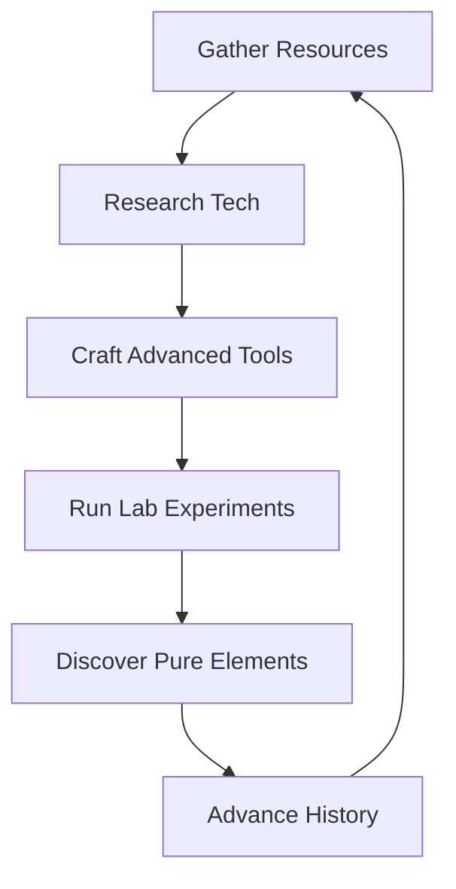

<p align="center">
  
</p>

<h1 align="center">Elemental Earth ⚗️</h1>

<p align="center">
  <strong>An incremental/idle crafting game themed around chemical elements and alchemy.</strong>
</p>

<p align="center">
  
  
  
  
  
</p>

---

Discover elements, craft tools, perform experiments, and advance through eras of chemical discovery. Elemental Earth combines the mechanics of idle games with real-world chemistry and mineralogy.

## ✨ Key Features

### 🛠️ Advanced Action System
- **Batch Processing**: Execute actions up to 20x or based on your task slots.
- **Dynamic Logic**: Actions adapt to available materials with a smart selection system.
- **Material-Dependent Rewards**: Discover hidden rewards that only drop when specific precursors are used.
- **Map Stratification**: Unique resources tied to geographical and geological contexts.

### 🧪 Realistic Laboratory
- **Complex Experiments**: Combine containers, materials, and operations (like heating, condensing, or distilling).
- **Process Chains**: Append multiple operations for advanced synthesis (e.g., *Electrolysis* -> *Gas Collection*).
- **Formula Discovery**: "Blind" results for new experiments until they are successfully proven.
- **Thermodynamics**: Manage fuel and ignition for high-temperature reactions.

### ⏳ Era Progression System
Journey through 5 distinct eras of human knowledge:

| Era | Key Milestones |
| :--- | :--- |
| **🪨 Stone Age** | Crafting primitive stone tools and mastering fire. |
| **⚗️ Alchemy** | Building kilns, early metallurgy, and pottery. |
| **🧪 Modern Chemistry** | Gas isolation, precision crucibles, and volumetric analysis. |
| **⚡ Electrochemistry** | Harnessing electricity for electrolysis and reactive metal extraction. |
| **💎 Rare Earth** | Modern separation techniques and atomic transmutation. |

---

## 🔄 Core Gameplay Loop



---

## 🖥️ Getting Started

### Prerequisites
- **Node.js**: 20.x or higher
- **npm**: Latest stable version

### Installation

```bash
# Clone the repository
git clone https://github.com/imlinhanchao/elemental-earth.git
cd elemental-earth

# Install all dependencies
npm install
cd server && npm install && cd ..
```

### Development

Run the backend and frontend simultaneously:

```bash
# Terminal 1: Backend API
cd server && npm start

# Terminal 2: Frontend Dev Server
npm run dev
```

> **Note:** Access the game at \`http://localhost:5173\`. The dev server proxies API requests to port \`3001\`.

---

## 🔧 Admin Panel & AI Integration

Elemental Earth includes a powerful administrative suite:

- **Data Management**: Full CRUD for items, actions, technologies, and formulas.
- **Visual Map Editor**: Drag-and-drop coordinate management for resource maps.
- **AI Content Generator**: Powered by OpenAI, it can generate scientifically plausible game content (minerals, reactions, techs) based on real-world chemistry.

---

## 🗺️ Project Architecture

```text
src/
├── stores/      # Core logic (Pinia): Task queue, Inventory, Game State
├── data/        # Static content: JSON definitions & Interfaces
├── views/       # Page components: Home, Lab, Tech Tree, Periodic Table
├── layouts/     # Application shells (Main Game & Admin)
├── utils/       # Infrastructure: Encryption, Notifications, Archive
└── components/  # Atomic UI components & Discovery animations
```

---

## 🎨 Design Philosophy

- **Atomic Fidelity**: Recipes and reactions follow real-world chemical principles.
- **Observable Science**: Items are described by their physical properties (color, state, texture).
- **Incremental Discovery**: Knowledge is earned, not given. Experimental results remain a mystery until first success.

---

## 📝 License

Distributed under the **MIT License**. See \`LICENSE\` for more information.
