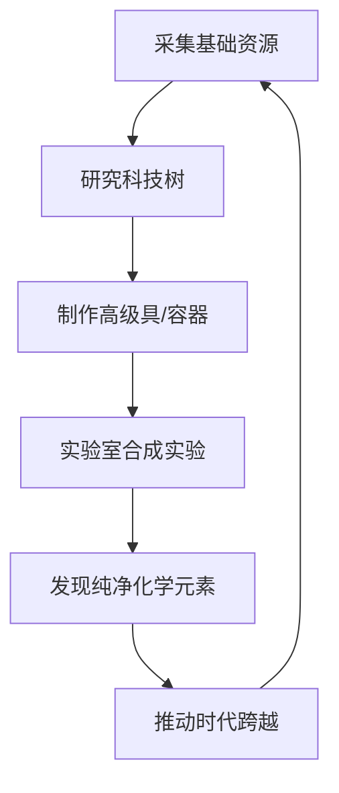

[English](README.md) / 简体中文

<p align="center">
  
</p>

<h1 align="center">元素纪元 ⚗️</h1>

<p align="center">
  <strong>一款以化学元素和炼金术为主题的增量/放置类科学模拟游戏。</strong>
</p>

<p align="center">
  
  
  
  
  
</p>

---

在化学发现的各个时代中不断前进，从原始的石器时代跨越到现代稀土科技。Elemental Earth 将放置游戏的策略性与真实的化学反应、矿物物理特性完美结合。

## ✨ 核心特性

### 🛠️ 深度行动系统
- **批量执行**：支持最高 20 倍动作并发，系统自动处理掉落与资源消耗。
- **智能替代**：动作支持材料替代方案，自动消耗现有最优资源。
- **关联产出**：基于消耗材料的细微差异，解锁隐藏的副产物。
- **地理志**：资源分布深度绑定地图场景，复现真实的自然资源分布。

### 🧪 拟真实验室
- **自由实验**：组合容器、反应物与多种实验操作（如煅烧、冷凝、过滤等）。
- **流程链条**：支持链式追加动作（例如：*电解* -> *排水集气*）。
- **配方发现**：在首次成功之前，所有的实验结果都是「未知领域」。
- **能源系统**：管理燃料与引火物质，精确控制反应温度。

### ⏳ 时代演进
见证人类文明的五大化学发现阶段：

| 时代 | 关键里程碑 |
| :--- | :--- |
| **🪨 石器时代** | 制作原始石质工具，掌握火的使用。 |
| **⚗️ 炼金术时代** | 建造窑炉，初步掌握冶金术与陶瓷工艺。 |
| **🧪 近代化学** | 气体的分离与收集，精密坩埚的使用，定量分析的开端。 |
| **⚡ 电化学时代** | 利用电力进行电解，提取高活性金属（如铝）。 |
| **💎 稀土时代** | 现代稀土元素分离技术与原子核嬗变。 |

---

## 🔄 核心玩法循环



---

## 🖥️ 快速开始

### 环境依赖
- **Node.js**: 20.x 或更高版本
- **npm**: 最新稳定版

### 安装步骤

```bash
# 克隆仓库
git clone https://github.com/imlinhanchao/elemental-earth.git
cd elemental-earth

# 安装全栈依赖
npm install
cd server && npm install && cd ..
```

### 开发模式启动

同时启动后端 API 与前端开发服务器：

```bash
# 终端 1: 后端服务
cd server && npm start

# 终端 2: 前端开发
npm run dev
```

> **注意：** 后台管理访问本地地址 `http://localhost:5173/#/admin`。开发服务器会自动将 API 请求代理到 `3001` 端口。

---

## 🔧 管理后台与 AI 支持

- **数据管理**：全量 CRUD 界面，轻松修改物品、动作、科技与配方。
- **可视化地图编辑器**：通过拖拽方式直观配置资源坐标。
- **AI 内容生成器**：深度集成 OpenAI，支持根据真实化学原理自动生成关联物品与反应路径。


## 🗺️ 项目架构

```text
src/
├── stores/      # 核心逻辑 (Pinia): 任务队列、背包、全局状态
├── data/        # 静态资源: JSON 数据定义与 TS 类型接口
├── views/       # 页面组件: 首页、实验室、科技树、周期表
├── layouts/     # 布局外壳 (包含游戏主界面与后台)
├── utils/       # 基础设施: 加密存取、通知系统、归档管理
└── components/  # 原子化 UI 与各种动态提示/动画
```

---

## 🎨 设计哲学

- **回归科学**：所有合成路径与反应过程尽可能遵循真实的化学原理。
- **表象描述**：材料描述侧重于视觉、触觉和物理性状，而非直接揭示用途。
- **探索感**：知识不是免费的。在没有配方记录前，每一次实验都是对未知的探索。

---

## 📝 开源协议

基于 **MIT License** 协议发布。详见 `LICENSE` 文件。
